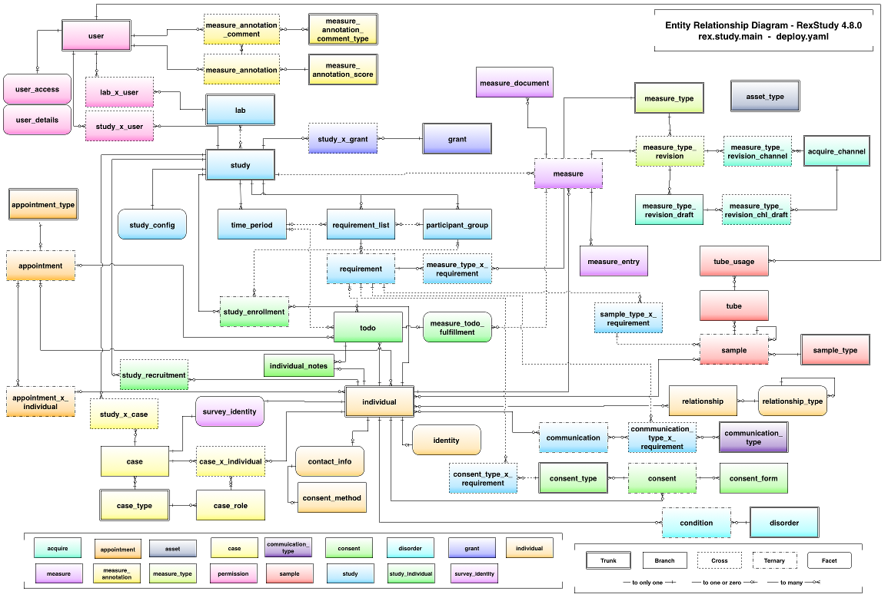

Querying Hierarchical Data
==========================

Hierarchical data model
-----------------------

.. slide:: Hierarchical Data Model
   :level: 2

    Data is organized in a tree structure.

    .. graphviz:: citydb-hierarchical-model.dot

.. slide:: Hierarchical Data Model: JSON
   :level: 3

    JSON is a way to store hierarchical data.

    .. code-block:: json

        {
            "departments": [
                {
                    "name": "WATER MGMNT",
                    "employees": [
                        {
                            "name": "ELVIA",
                            "surname": "A",
                            "position": "WATER RATE TAKER",
                            "salary": 87228
                        },
                        ... ]
                },
                ... ]
        }

.. slide:: Hierarchical Data Model: Asking Questions
   :level: 3

    Example: *For each department, find the number of employees with the salary
    higher that $100k.*

    Can use a programming language, e.g. Julia:

    .. code-block:: julia

        Depts_With_Num_Well_Paid_Empls(data) =
            map(d -> Dict(
                    "name" => d["name"],
                    "N100k" =>
                        length(filter(e -> e["salary"] > 100000, d["employees"]))),
                data["departments"])

    .. code-block:: jlcon

        julia> Depts_With_Num_Well_Paid_Empls(citydb)
        35-element Array{Any,1}:
         Dict("name"=>"WATER MGMNT","N100k"=>179)
         Dict("name"=>"POLICE","N100k"=>1493)
         ⋮

.. slide:: Hierarchical Data Model: Asking Questions 2
   :level: 3

    *For each department, find the number of employees with the salary > $100k.*

    .. code-block:: julia

        Depts_With_Num_Well_Paid_Empls(data) =
            map(d -> Dict(
                    "name" => d["name"],
                    "N100k" =>
                        length(filter(e -> e["salary"] > 100000, d["employees"]))),
                data["departments"])

    Not too bad, but can we do better?

    In particular, can we eliminate anonymous functions?

.. slide:: Hierarchical Data Model: Query Language
   :level: 3

    We will build a "query language" for JSON "databases".

    In 50 lines of Julia code:

    * *Traverse the hierarchy.*
    * *Summarize data.*
    * *Construct new data.*
    * *Filter data.*

    Will help to motivate semantics of **Rabbit**.

Before we proceed with designing a query language for functional data model,
let us review a much simpler data model called *hierarchical*.

In hierarchical data model, data is organized in a tree-like structure.
Continuing with our running example, a collection of city employees (source_)
can be structured in a 2-level hierarchy:

- list of departments;
- for each department, a list of employees.

.. _source: https://data.cityofchicago.org/Administration-Finance/Current-Employee-Names-Salaries-and-Position-Title/xzkq-xp2w

We can visualize this hierarchy as a diagram.

.. graphviz:: citydb-hierarchical-model.dot

To represent hierarchical data, it will be convenient for us to use JSON
format.  That lets us load and manipulate data directly using any programming
language.

Here is a fragment of data in JSON format.

.. code-block:: json

    {
        "departments": [
            {
                "name": "WATER MGMNT",
                "employees": [
                    {
                        "name": "ELVIA",
                        "surname": "A",
                        "position": "WATER RATE TAKER",
                        "salary": 87228
                    },
                    {
                        "name": "VICENTE",
                        "surname": "A",
                        "position": "CIVIL ENGINEER IV",
                        "salary": 99648
                    },
                    ...
                ]
            },
            {
                "name": "POLICE",
                "employees": [
                    {
                        "name": "JEFFERY",
                        "surname": "A",
                        "position": "POLICE OFFICER",
                        "salary": 75372
                    },
                    {
                        "name": "KARINA",
                        "surname": "A",
                        "position": "POLICE OFFICER",
                        "salary": 75372
                    },
                    ...
                ]
            },
            ...
        ]
    }

How does one answer questions about hierarchical data?  Consider a problem:

    *For each department, find the number of employees with the annual salary
    higher that 100k.*

We can answer this question by writing some code in a programming language of
our choice (we use Julia_ here).  We will write it in functional style, using
high-order functions ``map`` and ``filter`` to process the data:

.. code-block:: julia

    Depts_With_Num_Well_Paid_Empls(data) =
        map(d -> Dict(
                "name" => d["name"],
                "N100k" =>
                    length(filter(e -> e["salary"] > 100000, d["employees"]))),
            data["departments"])

Alternatively, this code could be written using a nested loop.  Either way, we
get an answer to the question:

.. code-block:: jlcon

    julia> Depts_With_Num_Well_Paid_Empls(citydb)
    35-element Array{Any,1}:
     Dict("name"=>"WATER MGMNT","N100k"=>179)
     Dict("name"=>"POLICE","N100k"=>1493)
     Dict("name"=>"GENERAL SERVICES","N100k"=>79)
     ⋮

Is there a way to make this code more query-like?  Let us review what we need
to do in order to answer the question stated by the query.  We could classify
the operations as follows.

Traversing data
    In this query, we process two levels of the database hierarchy: departments
    and their respective employees.

Filtering data
    We refine the set of employees by keeping those that satisfy a certain
    condition.

Summarizing data
    We transform an array (of employees) to a scalar value (the number of
    employees).

Constructing data
    We present the output as an array of objects with two fields: "department
    name" and "number of employees".

Let us use this insight to build a "query language" for hierarchical data
model.

.. _Julia: http://julialang.org/

Combinators
-----------

.. slide:: Combinators
   :level: 2

    *A JSON combinator* is a function that maps JSON input to JSON output.

    Example: *constant* combinator.

    .. code-block:: julia

        Const(val) = x -> val

    .. code-block:: jlcon

        julia> C = Const(42)
        julia> C(true), C(42), C([1, 2, 3])
        (42, 42, 42)

    Example: *identity* combinator.

    .. code-block:: julia

        This() = x -> x

    .. code-block:: jlcon

        julia> I = This()
        julia> I(true), I(42), I([1, 2, 3])
        (true, 42, [1, 2, 3])

.. slide:: Field Extractor
   :level: 2

   ``Field(name)`` extracts a field value from a JSON object.

    .. code-block:: julia

        Field(name) = x -> x[name]

    .. code-block:: jlcon

        julia> Name = Field("name")
        julia> Name(Dict("name" => "RAHM", "surname" => "E", "salary" => 216210))
        "RAHM"

    .. code-block:: jlcon

        julia> Salary = Field("salary")
        julia> Salary(Dict("name" => "RAHM", "surname" => "E", "salary" => 216210))
        216210

.. slide:: Querying with Combinators
   :level: 2

    .. code-block:: julia

        Field(name) = x -> x[name]

    ``Field`` is a combinator constructor, a function that returns a combinator.

    ``Field("salary")`` is a JSON combinator, a function that maps JSON to JSON.

    Creating a combinator (*constructing a query*):

    .. code-block:: jlcon

        julia> Salary = Field("salary")

    Applying the combinator (*executing a query*):

    .. code-block:: jlcon

        julia> Salary(Dict("name" => "RAHM", "surname" => "E", "salary" => 216210))
        216210

We need to introduce some new primitives and operations.  We start with the notion
of *JSON combinators*.

A JSON combinator is any function that maps JSON input to JSON output.  Two trivial
examples of JSON combinators are:

* ``Const(val)``, which maps each input to the constant value ``val``.
* ``This()``, which copies the input to the output.

In Julia, they could be defined as follows:

.. code-block:: julia

    Const(val) = x -> val

.. code-block:: julia

    This() = x -> x

We need to distinguish between combinators and combinator constructors.
``Const`` is a combinator constructor, a function that returns a combinator.
``Const(42)`` is a combinator, a function that for any JSON input returns a
fixed JSON output, the number ``42``.

.. code-block:: jlcon

    julia> C = Const(42)

    julia> C(true)
    42

    julia> C(42)
    42

    julia> C([1, 2, 3])
    42

Similarly, function ``This`` constructs a combinator that returns its input
unchanged.

.. code-block:: jlcon

    julia> I = This()

    julia> I(true)
    true

    julia> I(42)
    42

    julia> I([1, 2, 3])
    [1, 2, 3]

Let us define a more interesting combinator.  ``Field(name)`` extracts a field
value from a JSON object.

.. code-block:: julia

    Field(name) = x -> x[name]

Let us define some field extractors:

.. code-block:: jlcon

    julia> Name = Field("name")
    julia> Salary = Field("salary")

Then expressions ``Name(data)`` and ``Salary(data)`` yield values
``data["name"]`` and ``data["salary"]``:

.. code-block:: jlcon

    julia> Name(Dict("name" => "RAHM", "surname" => "E", "salary" => 216210))
    "RAHM"
    julia> Salary(Dict("name" => "RAHM", "surname" => "E", "salary" => 216210))
    216210

Field extractors will become basic building blocks in our query language.

Notice a common pattern in our examples:

* First, we create a combinator using combinator constructors.
* Then, we apply the combinator against the data.

We interpret a combinator as a database query.  Then creating a combinator is
the same as *constructing a query*, and and applying the combinator is
*executing a query*.

For comparison, here is an equivalent implementation in Python:

.. code-block:: python

    def Const(val):
        def f(x):
            return val
        return f

    def This():
        def f(x):
            return x
        return f

    def Field(name):
        def f(x):
            return x[name]
        return f

and in Javascript:

.. code-block:: javascript

    function Const(val) {
        return function (x) { return val; };
    }

    function This() {
        return function (x) { return x; };
    }

    function Field(name) {
        return function (x) { return x[name]; };
    }

Traversing the hierarchy
------------------------

.. slide:: Traversing the Hierarchy
   :level: 2

    *Find the names of all departments.*

    .. graphviz:: citydb-department-names.dot

    Need to traverse the hierarchical structure.

.. slide:: Traversing the Hierarchy: Query
   :level: 3

    *Find the names of all departments.*

    We certainly need field extractors:

    .. code-block:: julia

        Departments = Field("departments")
        Name = Field("name")

    Combine them with the *traversal* operator (``>>``):

    .. code-block:: julia

        Dept_Names = Departments >> Name

.. slide:: Traversing the Hierarchy: Output
   :level: 3

    *Find the names of all departments.*

    .. code-block:: julia

        Dept_Names = Departments >> Name

    .. code-block:: jlcon

        julia> Dept_Names(citydb)
        35-element Array{Any,1}:
         "WATER MGMNT"
         "POLICE"
         "GENERAL SERVICES"
         ⋮

    How is ``>>`` implemented?

.. slide:: Traversal Operator
   :level: 2

    Traversal operator ``(F >> G)`` sends the output of ``F`` to the input of
    ``G``.

    Naively:

    .. code-block:: julia

        (F >> G) = x -> G(F(x))

    But this doesn't work!

    .. code-block:: julia

        (Departments >> Name)(citydb)

    translates into

    .. code-block:: julia

        citydb["departments"]["name"]

    which fails because ``citydb["departments"]`` is an array.

.. slide:: Traversal Operator: Arrays as Streams
   :level: 3

    An array is not a value, but a stream of values.

    Traversal operator applies combinators to individual elements of the
    stream.

    When :math:`F(x)` is a scalar:

    .. math::

        (F \gg G):
        x \;\overset{F}{\longmapsto}\;
        F(x) \;\overset{G}{\longmapsto}\;
        G(F(x))

    However, when :math:`F(x)` is an array :math:`[y_1,\, y_2,\, \ldots]`:

    .. math::

        (F \gg G):
        x \;\overset{F}{\longmapsto}\;
        [y_1,\, y_2,\, \ldots] \;\overset{G}{\longmapsto}\;
        [G(y_1),\, G(y_2),\, \ldots]

    ``Departments >> Name`` now works as expected.

.. slide:: Traversal Operator: Flattening
   :level: 3

    When :math:`F(x)` is an array:

    .. math::

        (F \gg G):
        x \;\overset{F}{\longmapsto}\;
        [y_1,\, y_2,\, \ldots] \;\overset{G}{\longmapsto}\;
        [G(y_1),\, G(y_2),\, \ldots]

    What if :math:`G(y_k)` are also arrays :math:`[z_{k1},\, z_{k2},\,
    \ldots]`?

    A value stream in a value stream?  Flatten it:

    .. math::

        (F \gg G):
        x \;\overset{F}{\longmapsto}\;
        [y_1,\, y_2,\, \ldots] \;\overset{G}{\longmapsto}\;
        [z_{11},\, z_{12},\, \ldots,\, z_{21},\, z_{22},\, \ldots]

    Also, :math:`\operatorname{null}` means lack of value.

    If :math:`G(y_k)` produces :math:`\operatorname{null}`, skip it.  Will use
    this later for filtering.

.. slide:: Traversal Operator: Flattening Example
   :level: 3

    *Find the names of all employees.*

    .. graphviz:: citydb-employee-names.dot

    .. code-block:: julia

        Departments = Field("departments")
        Employees = Field("epmployees")
        Name = Field("name")

        Empl_Names = Departments >> Employees >> Name

.. slide:: Traversal Operator: Flattening Example Output
   :level: 3

    *Find the names of all employees.*

    .. code-block:: julia

        Departments = Field("departments")
        Employees = Field("epmployees")
        Name = Field("name")

        Empl_Names = Departments >> Employees >> Name

    .. code-block:: jlcon

        julia> Empl_Names(citydb)
        32181-element Array{Any,1}:
         "ELVIA"
         "VICENTE"
         "MUHAMMAD"
         ⋮

    Traversal operator is associative.

.. slide:: Traversal Operator: Implementation
   :level: 3

    .. code-block:: julia

        (F >> G) = x -> _flat(_map(G, F(x)))

        _flat(z) =
            isa(z, Array) ? foldr(vcat, [], z) : z
        _map(G, y) =
            isa(y, Array) ? map(_expand, map(G, y)) : G(y)
        _expand(z_i) =
            isa(z_i, Array) ? z_i : z_i != nothing ? [z_i] : []

Consider the following problem:

    *Find the names of all departments.*

To build a query producing department names, we need to construct a path in the
hierarchical structure of the database.

.. graphviz:: citydb-department-names.dot

Let us highlight the data we need to fetch from the database:

.. code-block:: json
   :emphasize-lines: 2,4,15

    {
        "departments": [
            {
                "name": "WATER MGMNT",
                "employees": [
                    {
                        "name": "ELVIA",
                        "surname": "A",
                        "position": "WATER RATE TAKER",
                        "salary": 87228
                    },
                    ... ]
            },
            {
                "name": "POLICE",
                "employees": [
                    {
                        "name": "JEFFERY",
                        "surname": "A",
                        "position": "POLICE OFFICER",
                        "salary": 75372
                    },
                    ... ]
            },
            ... ]
    }

Definitely, we will need extractors for fields ``"departments"`` and
``"name"``:

.. code-block:: julia

    Departments = Field("departments")
    Name = Field("name")

The query must somehow chain combinators ``Departments`` and ``Name`` to
produce the desired result.  *The traversal operator* (:math:`\gg`) does that:

.. code-block:: julia

    Dept_Names = Departments >> Name

Here is the output of the query:

.. code-block:: jlcon

    julia> Dept_Names(citydb)
    35-element Array{Any,1}:
     "WATER MGMNT"
     "POLICE"
     "GENERAL SERVICES"
     ⋮

We got the result we expected, but how exactly the traversal operator works?

Traversal operator ``(F >> G)`` sends the output of ``F`` to the input of
``G``.  In other words, it is a variant of *a composition operator*.  However
it can't be implemented naively as:

.. code-block:: julia

    (F >> G) = x -> G(F(x))

Indeed, If ``(F >> G)`` is defined this way, the query ``(Departments >>
Name)(citydb)`` yields ``citydb["departments"]["name"]``, which fails
because ``citydb["departments"]`` is an array and so it doesn't have a field
``"name"``.

It appears, in expression ``(Departments >> Name)``, the traversal operator has
to apply its second operand ``Name`` to each element of the array produced by
its first operand ``Departments``.  Here is the idea.  The traversal operator
must treat arrays not as a single JSON value, but as a sequence of values.

When :math:`F` produces a sequence of values:

.. math::

    x \overset{F}{\longmapsto} y_1,\, y_2,\, y_3,\, \ldots

the traversal operator :math:`(F \gg G)` also generates a sequence of values:

.. math::

    x \overset{F \gg G}{\longmapsto} G(y_1),\, G(y_2),\, G(y_3),\, \ldots

Moreover, :math:`G(y_k)` could also be an array:

.. math::

    y_k \overset{G}{\longmapsto} z_{k1},\, z_{k2},\, z_{k3},\, \ldots

In this case, we again interpret :math:`G(y_k)` as a sequence of values and
merge it into the output sequence:

.. math::

    x \overset{F \gg G}{\longmapsto} z_{11},\, z_{12},\, \ldots,\, z_{21},\, z_{22},\, \ldots

Finally, if :math:`G(y_k)` produces a JSON :math:`\operatorname{null}` value,
we regard is as *no-value* and remove it from the output.  We will use this
feature later to implement filtering.

Let us demonstrate traversal on another example:

    *Find the names of all employees.*

To implement this query, we need to traverse the following path:

.. graphviz:: citydb-employee-names.dot

Again, we highlight the data we need to fetch from the database.

.. code-block:: json
   :emphasize-lines: 2,5,7,13

    {
        "departments": [
            {
                "name": "WATER MGMNT",
                "employees": [
                    {
                        "name": "ELVIA",
                        "surname": "A",
                        "position": "WATER RATE TAKER",
                        "salary": 87228
                    },
                    {
                        "name": "VICENTE",
                        "surname": "A",
                        "position": "CIVIL ENGINEER IV",
                        "salary": 99648
                    },
                    ... ]
            },
            ... ]
    }

We construct the query by chaining respective field extractors with the
traversal operator:

.. code-block:: julia

    Departments = Field("departments")
    Employees = Field("epmployees")
    Name = Field("name")

    Empl_Names = Departments >> Employees >> Name

.. code-block:: jlcon

    julia> Empl_Names(citydb)
    32181-element Array{Any,1}:
     "ELVIA"
     "VICENTE"
     "MUHAMMAD"
     ⋮

Let us review how this query processes the data.  Query ``(Departments >>
Employees >> Name)`` starts with sending its input to the ``Department``
combinator, which produces a sequence of department objects:

.. code-block:: json

    [
        {
            "name": "WATER MGMNT",
            "employees": [
                { "name": "ELVIA", "surname": "A", ... },
                { "name": "VICENTE", "surname": "A", ... },
                ... ]
        },
        {
            "name": "POLICE",
            "employees": [
                { "name": "JEFFERY", "surname": "A", ... },
                { "name": "KARINA", "surname": "A", ... },
                ... ]
        },
        ...
    ]

Then, after a subsequent application of ``Employees`` combinator, we get:

.. code-block:: json

    [
        { "name": "ELVIA", "surname": "A", ... },
        { "name": "VICENTE", "surname": "A", ... },
        ...
        { "name": "JEFFERY", "surname": "A", ... },
        { "name": "KARINA", "surname": "A", ... },
        ...
    ]

Finally, applying ``Name`` gives us the output:

.. code-block:: json

    [
        "ELVIA",
        "VICENTE",
        ...
        "JEFFERY",
        "KARINA",
        ...
    ]

We conclude this section by implementing the traversal operator in Julia:

.. code-block:: julia

    (F >> G) = x -> _flat(_map(G, F(x)))

    _flat(z) =
        isa(z, Array) ? foldr(vcat, [], z) : z
    _map(G, y) =
        isa(y, Array) ? map(_expand, map(G, y)) : G(y)
    _expand(z_i) =
        isa(z_i, Array) ? z_i : z_i != nothing ? [z_i] : []

Summarizing data
----------------

.. slide:: Summarizing Data
   :level: 2

    *Find the number of departments.*

    Need a combinator that can count the number of elements in an array.

    Naively, define:

    .. code-block:: julia

        Count() = length

    Then use:

    .. code-block:: julia

        Departments = Field("departments")

        Num_Depts = Departments >> Count()

    Does not work!

.. slide:: Summarizing Data: Counting
   :level: 3

    *Find the number of departments.*

    .. code-block:: julia

        Count() = length

    .. code-block:: julia

        Num_Depts = Departments >> Count()

    Does not work!

    * ``Departments`` generates an array of departments;
    * Traversal (``>>``) will not let ``Count()`` see it as a whole;
    * Instead it will feed it to ``Count()`` one by one.

    What to do?

.. slide:: Summarizing Data: Counting 2
   :level: 3

    *Find the number of departments.*

    Pass an array-producing combinator as a parameter to ``Count()``:

    .. code-block:: julia

        Count(F) = x -> length(F(x))

    .. code-block:: julia

        Num_Depts = Count(Departments)

    .. code-block:: jlcon

        julia> Num_Depts(citydb)
        35

.. slide:: Aggregates and Traversal
   :level: 2

    How to properly combine aggregates and traversal?

    * *Count the number of employees for each department.*
    * *Count the total number of employees.*

    We need to combine traversal ``Departments >> Employees`` with ``Count()``.
    How?

.. slide:: Aggregates and Traversal: 2
   :level: 3

    *Count the number of employees for each department.*

    .. code-block:: julia

        Num_Empls_Per_Dept = Departments >> Count(Employees)

    .. code-block:: jlcon

        julia> Num_Empls_Per_Dept(citydb)
        35-element Array{Any,1}:
          1848
         13570
           924
             ⋮

.. slide:: Aggregates and Traversal: 3
   :level: 3

    *Count the number of employees for each department.*

    .. code-block:: julia

        Num_Empls_Per_Dept = Departments >> Count(Employees)

    * ``Departments`` produces a stream of department entities.
    * For each department, ``Count(Employees)`` calculates the number of
      employees.

    *Number of employees* is a property of each *department*.  This dictates
    the placement of ``>>``:

    .. math:: \textit{entity} \gg \textit{property}

.. slide:: Aggregates and Traversal: 4
   :level: 3

    *Count the total number of employees.*

    .. code-block:: julia

        Num_Empls = Count(Departments >> Employees)

    .. code-block:: jlcon

        julia> Num_Empls(citydb)
        32181

    *Total number of employees* is a global property.

.. slide:: Aggregates and Traversal: Conclusion
   :level: 3

    *Count the number of employees for each department.*

    .. code-block:: julia

        Num_Empls_Per_Dept = Departments >> Count(Employees)

    *Count the total number of employees.*

    .. code-block:: julia

        Num_Empls = Count(Departments >> Employees)

    Cannot differentiate between two cases with our original proposal:

    .. code-block:: julia

        Departments >> Employees >> Count()

.. slide:: Other Aggregates
   :level: 2

    *Find the top salary.*

    .. code-block:: julia

        Max(F) = x -> maximum(F(x))

    .. code-block:: julia

        Max_Salary = Max(Departments >> Employees >> Salary)

    .. code-block:: jlcon

        julia> Max_Salary(citydb)
        260004

.. slide:: Combining Aggregates
   :level: 2

    *Find the maximum number of employees among all departments.*

    We know how to *find the number of employees per department.*

    .. code-block:: julia

        Num_Empls_Per_Dept = Departments >> Count(Employees)

    Summarizing it, we *find the maximum.*

    .. code-block:: julia

        Max_Empls_Per_Dept = Max(Departments >> Count(Employees))

    .. code-block:: jlcon

        julia> Max_Empls_Per_Dept(citydb)
        13570

We learned how to extract data from the branches of the database hierarchy
tree.  Let us now show how to summarize data.

Consider a problem:

    *Find the number of departments.*

To solve it, we need a combinator that can count the number of elements in an
array.

In Julia, function ``length()`` returns the length of the array.  We may try to
define ``Count()`` combinator as follows:

.. code-block:: julia

    Count() = length

Then send it an array of department objects:

.. code-block:: julia

    Num_Depts =
        Departments >> Count()

However, this is not going to work.  The traversal operator will not let
``Count()`` see the whole array.  Instead, it will submit individual department
objects to the ``Count()`` combinator, which is not what we need.

Clearly, we cannot use the traversal operator to feed ``Count()`` with an array
value.  Instead, we will add an array-producing combinator as a parameter to
``Count`` constructor:

.. code-block:: julia

    Count(F) = x -> length(F(x))

To find the number of departments, we write:

.. code-block:: julia

    Num_Depts =
        Count(Departments)

.. code-block:: jlcon

    julia> Num_Depts(citydb)
    35

Although we solved the problem, the question remains: what is a proper way to
combine traversal and ``Count()``?

Consider the following two problems:

    * *Find the number of employees for each department.*
    * *Find the total number of employees.*

To solve them, we need to combine traversal from departments to employees with
application of ``Count()`` combinator.

To find the number of employees for each department, we write:

.. code-block:: julia

    Num_Empls_Per_Dept =
        Departments >> Count(Employees)

.. code-block:: jlcon

    julia> Num_Empls_Per_Dept(citydb)
    35-element Array{Any,1}:
      1848
     13570
       924
         ⋮

Let us examine how this query is executed:

1. ``Departments`` produces an array of department objects.
2. The traversal operator submits each department to ``Count(Employees)``
   combinator.
3. ``Count(Employees)`` sends its input to ``Employees`` combinator, which
   returns an array of employees associated with the input department;
   ``Count(Employees)`` returns the length of the array.
4. The traversal operator collects and returns an array of values
   produced by ``Count(Employees)``.

In general, the traversal operator follows the pattern:

.. math:: \textit{entity} \gg \textit{property}

In this example, "number of employees" is a property of each "department",
which dictates the placement of the ``>>`` operator relative to ``Count()``.

To find the total number of employees, we write:

.. code-block:: julia

    Num_Empls = Count(Departments >> Employees)

.. code-block:: jlcon

    julia> Num_Empls(citydb)
    32181

Here, ``Count()`` wraps the traversal expression.  Indeed, "total number of
employees" is a global property of the database and we calculate it at the root
of the database hierarchy.

Consider another problem:

    *Find the top salary among all the employees.*

We need a combinator that finds the maximum value in an array, which we can
define in the same way as ``Count()``:

.. code-block:: julia

    Max(F) = x -> maximum(F(x))

With ``Max``, the query is easy to write:

.. code-block:: julia

    Max_Salary = Max(Departments >> Employees >> Salary)

.. code-block:: jlcon

    julia> Max_Salary(citydb)
    260004

A combinator that summarizes the content of an array is called *an aggregate
combinator*.

We conclude this section with the following problem:

    *Find the maximum number of employees per department.*

To solve it, we will need to use both ``Max`` and ``Count`` aggregates.  We
already know how to find the number of employees per department:

.. code-block:: julia

    Num_Empls_Per_Dept = Departments >> Count(Employees)

Applying ``Max``, we get:

.. code-block:: julia

    Max_Empls_Per_Dept =
        Max(Departments >> Count(Employees))

.. code-block:: jlcon

    julia> Max_Empls_Per_Dept(citydb)
    13570

Constructing objects
--------------------

.. slide:: Constructing Objects
   :level: 2

    We learned to traverse and summarize data.  How to create new structured
    data?

    ``Select(...)`` constructs a new JSON object.

    .. code-block:: julia

        Select(fields...) =
            x -> Dict(map(f -> f.first => f.second(x), fields))

    Parameters of ``Select()``:

    * Field names;
    * Combinators for constructing field values.

.. slide:: Constructing Objects: Example
   :level: 3

    *Summarize the input array.*

    .. code-block:: jlcon

        julia> L = Count(This())
        julia> L([10, 20, 30])
        3

    .. code-block:: jlcon

        julia> M = Max(This())
        julia> M([10, 20, 30])
        30

    ``Select()`` passes its input to field constructors.

    .. code-block:: jlcon

        julia> S = Select("len" => Count(This()), "max" => Max(This()))
        julia> S([10, 20, 30])
        Dict{ASCIIString,Int64} with 2 entries:
          "len" => 3
          "max" => 30

.. slide:: Tabular Output
   :level: 2

    *For each department, find the number of employees.*

    We've done it already.

    .. code-block:: julia

        Num_Empls_Per_Dept = Departments >> Count(Employees)

    Now generate a table as an array of objects.

    .. code-block:: julia

        Depts_With_Size =
            Departments >> Select("name" => Name, "size" => Count(Employees))

    .. code-block:: jlcon

        julia> Depts_With_Size(citydb)
        35-element Array{Any,1}:
         Dict("name"=>"WATER MGMNT","size"=>1848)
         Dict("name"=>"POLICE","size"=>13570)
         ⋮

.. slide:: Tabular Output: Adding a Column
   :level: 3

    A new field could be added to ``Select()`` without changing other fields or
    the rest of the query.

    *For each department, find the number of employees and the top salary.*

    .. code-block:: julia

        Depts_With_Size_And_Max_Salary =
            Departments >> Select(
                "name" => Name,
                "size" => Count(Employees),
                "max_salary" => Max(Employees >> Salary))

    .. code-block:: jlcon

        julia> Depts_With_Size_And_Max_Salary(citydb)
        35-element Array{Any,1}:
         Dict("name"=>"WATER MGMNT","max_salary"=>169512,"size"=>1848)
         Dict("name"=>"POLICE","max_salary"=>260004,"size"=>13570)
         ⋮

In the previous section, we built a query to find the number of employees
per department:

.. code-block:: julia

    Num_Empls_Per_Dept =
        Departments >> Count(Employees)

.. code-block:: jlcon

    julia> Num_Empls_Per_Dept(citydb)
    35-element Array{Any,1}:
      1848
     13570
       924
         ⋮

Unfortunately, this query produces a raw array of numbers disconnected from the
respective departments.  We'd like to get the output in a tabular form, that
is, as an array of objects with two fields: the department name and the number
of employees.  To implement this, we need a combinator that can construct new
JSON objects.

Combinator

.. math:: \operatorname{Select}(\textit{name}_1 \Rightarrow F_1,\, \textit{name}_2 \Rightarrow F_2,\, \ldots)

is parameterized with a list of field names and field constructors.  For any
input, it produces a new JSON object with fields

.. math:: \textit{name}_1,\, \textit{name}_2,\, \ldots

and values are generated from the input by field constructors

.. math:: F_1,\,F_2,\,\ldots.

Here is a definition of ``Select()`` in Julia:

.. code-block:: julia

    Select(fields...) =
        x -> Dict(map(f -> f.first => f.second(x), fields))

Let us demonstrate ``Select()`` on a simple example.  Define combinators
that determine the size and the maximum element of the input array:

.. code-block:: jlcon

    julia> L = Count(This())
    julia> L([10, 20, 30])
    3

.. code-block:: jlcon

    julia> M = Max(This())
    julia> M([10, 20, 30])
    30

Now use ``Select`` to combine the output of ``L`` and ``M`` in a single JSON
object:

.. code-block:: jlcon

    julia> S = Select("len" => Count(This()), "max" => Max(This()))
    julia> S([10, 20, 30])
    Dict{ASCIIString,Int64} with 2 entries:
      "len" => 3
      "max" => 30

Let us get back to the problem we stated at the beginning of the section:

    *For each department, find the number of employees.*

Using ``Select()`` we can generate a "table" with two "columns": ``name``, the
name of the department, and ``size``, the number of employees in the
department:

.. code-block:: julia

    Depts_With_Size =
        Departments >> Select("name" => Name, "size" => Count(Employees))

.. code-block:: jlcon

    julia> Depts_With_Size(citydb)
    35-element Array{Any,1}:
     Dict("name"=>"WATER MGMNT","size"=>1848)
     Dict("name"=>"POLICE","size"=>13570)
     Dict("name"=>"GENERAL SERVICES","size"=>924)
     ⋮

To add or rearrange table columns, we add or rearrange field constructors in
the ``Select()`` clause.  For example, to add a column ``max_salary``, the top
salary per department, we write:

.. code-block:: julia

    Depts_With_Size_And_Max_Salary =
        Departments >> Select(
            "name" => Name,
            "size" => Count(Employees),
            "max_salary" => Max(Employees >> Salary))

.. code-block:: jlcon

    julia> Depts_With_Size_And_Max_Salary(citydb)
    35-element Array{Any,1}:
     Dict("name"=>"WATER MGMNT","max_salary"=>169512,"size"=>1848)
     Dict("name"=>"POLICE","max_salary"=>260004,"size"=>13570)
     Dict("name"=>"GENERAL SERVICES","max_salary"=>157092,"size"=>924)
     ⋮

Notably, we didn't need to change the other fields or the rest of the query.
At the same time, adding a new field to ``Select()`` cannot affect the other
fields in any way.   This property is an instance of so called *principle of
compositionality*.

Filtering data
--------------

.. slide:: Filtering
   :level: 2

    *Find the employees with salary greater than $200k.*

    Need a combinator that could filter data.  We'd like to write:

    .. code-block:: julia

        Very_Well_Paid_Empls =
            Departments >> Employees >> Sieve(Salary > 200000)

    .. code-block:: jlcon

        julia> Very_Well_Paid_Empls(citydb)
        3-element Array{Any,1}:
         Dict("name"=>"GARRY","surname"=>"M","position"=>"SUPERINTENDENT OF POLICE",
        "salary"=>260004)
         Dict("name"=>"JOSE","surname"=>"S","position"=>"FIRE COMMISSIONER","salary"=>202728)
         Dict("name"=>"RAHM","surname"=>"E","position"=>"MAYOR","salary"=>216210)

    How does ``Sieve()`` (and ``>``) work?

.. slide:: Filtering: ``Sieve()``
   :level: 3

    *Find the employees with salary greater than $200k.*

    .. code-block:: julia

        Very_Well_Paid_Empls =
            Departments >> Employees >> Sieve(Salary > 200000)

    Define:

    .. code-block:: julia

        Sieve(P) = x -> P(x) ? x : nothing

    Traversal (``>>``) operates on a stream of values.  It interprets
    ``nothing`` as *a no-value* and throws it out from the output stream.

    ``Sieve()`` needs predicate combinators (``>``, etc).

.. slide:: Filtering: Predicates
   :level: 3

    *Find the employees with salary greater than $200k.*

    .. code-block:: julia

        Very_Well_Paid_Empls =
            Departments >> Employees >> Sieve(Salary > 200000)

    .. code-block:: julia

        Sieve(P) = x -> P(x) ? x : nothing

    A predicate is a combinator that returns ``true`` or ``false``.

    .. code-block:: julia

        (>)(F::Function, G::Function) = x -> F(x) > G(x)
        (>)(F::Function, n::Number) = F > Const(n)

.. slide:: How Filtering Works?
   :level: 2

    .. code-block:: jlcon

        julia> Salary = Field("salary")
        julia> Salary(Dict("name" => "RAHM", "surname" => "E", "salary" => 216210))
        216210
        julia> Salary(Dict("name" => "STEVEN", "surname" => "K", "salary" => 1))
        1

    .. code-block:: jlcon

        julia> P = Salary > 200000
        julia> P(Dict("name" => "RAHM", "surname" => "E", "salary" => 216210))
        true
        julia> P(Dict("name" => "STEVEN", "surname" => "K", "salary" => 1))
        false

    .. code-block:: jlcon

        julia> F = Sieve(P)
        julia> F(Dict("name" => "RAHM", "surname" => "E", "salary" => 216210))
        Dict("name"=>"RAHM","surname"=>"E","salary"=>216210)
        julia> F(Dict("name" => "STEVEN", "surname" => "K", "salary" => 1))
        nothing

.. slide:: Filtering and Traversal
   :level: 2

    We can insert ``Sieve()`` to the traversal chain.

    *Find departments with more than 1000 employees.*

    .. code-block:: julia

        Large_Depts =
            Departments >> Sieve(Count(Employees) > 1000) >> Name

    .. code-block:: jlcon

        julia> Large_Depts(citydb)
        7-element Array{Any,1}:
         "WATER MGMNT"
         "POLICE"
         "STREETS & SAN"
         ⋮

.. slide:: Filtering and Selection
   :level: 2

    In the same manner, ``Sieve()`` can be combined with ``Select()``:

    *Find departments with more than 1000 employees.*

    .. code-block:: julia

        Size = Field("size")

        Large_Depts =
            Departments >> Select(
                "name" => Name,
                "size" => Count(Employees)) >> Sieve(Size > 1000)

.. slide:: Filtering and Aggregates
   :level: 2

    Aggregates and filtering could be combined in a number of ways.

    *Find the number of departments with more than 1000 employees.*

    .. code-block:: julia

        Num_Large_Depts =
            Count(Departments >> Sieve(Count(Employees) > 1000))

    .. code-block:: jlcon

        julia> Num_Large_Depts(citydb)
        7

.. slide:: Querying in Hierarchical Model
   :level: 2

    *For each department, find the number of employees with salary higher than
    $100k.*

    .. code-block:: julia

        Depts_With_Num_Well_Paid_Empls =
            Departments >>
            Select(
                "name" => Name,
                "N100k" => Count(Employees >> Sieve(Salary > 100000)))

    .. code-block:: jlcon

        julia> Depts_With_Num_Well_Paid_Empls(citydb)
        35-element Array{Any,1}:
         Dict("name"=>"WATER MGMNT","N100k"=>179)
         Dict("name"=>"POLICE","N100k"=>1493)
         Dict("name"=>"GENERAL SERVICES","N100k"=>79)
         ⋮

.. slide:: Querying in Hierarchical Model: Comparison
   :level: 3

    *For each department, find the number of employees with salary higher than
    $100k.*

    Was:

    .. code-block:: julia

        Depts_With_Num_Well_Paid_Empls(data) =
            map(d -> Dict(
                    "name" => d["name"],
                    "N100k" =>
                        length(filter(e -> e["salary"] > 100000, d["employees"]))),
                data["departments"])

    Became:

    .. code-block:: julia

        Depts_With_Num_Well_Paid_Empls =
            Departments >> Select(
                "name" => Name,
                "N100k" => Count(Employees >> Sieve(Salary > 100000)))

Consider a problem:

    *Find the employees with salary greater than $200k.*

To solve it, we need a way to refine data.  Specifically, we need a JSON
combinator that, given a set of values and a predicate, produces the values
that satisfy the predicate condition.

Let us define combinator ``Sieve()`` by:

.. code-block:: julia

    Sieve(P) = x -> P(x) ? x : nothing

That is, if the input satisfies the predicate condition, pass it through;
otherwise, return ``nothing``.

*A predicate* is a combinator that for any input returns either ``true`` or
``false``.  Here is the implementation of the ``>`` operator in Julia:

.. code-block:: julia

    (>)(F::Function, G::Function) = x -> F(x) > G(x)
    (>)(F::Function, n::Number) = F > Const(n)

Other comparison (``>``, ``>=``, ``<``, ``<=``, ``==``, ``!=``), logical
(``&``, ``|``, ``!``) and arithmetic (``+``, ``-``, ``*``, ``/``) operators are
defined in the same way.

Let us demonstrate how ``Sieve()`` and predicate operators work on a simple
example:

1. Combinator ``Field("salary")`` extracts the value of field ``"salary"``
   from the input object:

   .. code-block:: jlcon

        julia> Salary = Field("salary")
        julia> Salary(Dict("name" => "RAHM", "surname" => "E", "salary" => 216210))
        216210
        julia> Salary(Dict("name" => "STEVEN", "surname" => "K", "salary" => 1))
        1

2. Combinator ``Const(200000)`` returns value ``200000`` on any input:

   .. code-block:: jlcon

        julia> _200000 = Const(200000)
        julia> _200000(Dict("name" => "RAHM", "surname" => "E", "salary" => 216210))
        200000
        julia> _200000(Dict("name" => "STEVEN", "surname" => "K", "salary" => 1))
        200000

3. Like ``Count``, predicate operator ``(F > G)`` does not directly operate on
   the input value.  Instead it processes its input through ``F`` and ``G`` and
   then compares their outputs:

   .. code-block:: jlcon

        julia> P = Salary > 200000
        julia> P(Dict("name" => "RAHM", "surname" => "E", "salary" => 216210))
        true
        julia> P(Dict("name" => "STEVEN", "surname" => "K", "salary" => 1))
        false

4. ``Sieve`` passes its input through if it satisfies the predicate condition:

   .. code-block:: jlcon

        julia> F = Sieve(P)
        julia> F(Dict("name" => "RAHM", "surname" => "E", "salary" => 216210))
        Dict("name"=>"RAHM","surname"=>"E","salary"=>216210)
        julia> F(Dict("name" => "STEVEN", "surname" => "K", "salary" => 1))
        nothing

The traversal operator drops value ``nothing`` from the output.  That allows us
to insert ``Sieve`` into the traversal chain to filter it.  To find the
employees with salary greater than $200k, we write:

.. code-block:: julia

    Very_Well_Paid_Empls =
        Departments >> Employees >> Sieve(Salary > 200000)

.. code-block:: jlcon

    julia> Very_Well_Paid_Empls(citydb)
    3-element Array{Any,1}:
     Dict("name"=>"GARRY","surname"=>"M","position"=>"SUPERINTENDENT OF POLICE","salary"=>260004)
     Dict("name"=>"JOSE","surname"=>"S","position"=>"FIRE COMMISSIONER","salary"=>202728)
     Dict("name"=>"RAHM","surname"=>"E","position"=>"MAYOR","salary"=>216210)

``Sieve()`` doesn't need to be the last item in the traversal chain.  For example,
consider a problem:

    *Find the departments with more than 1000 employees.*

To get the names of departments that satisfy this condition, we write:

.. code-block:: julia

    Large_Depts =
        Departments >> Sieve(Count(Employees) > 1000) >> Name

.. code-block:: jlcon

    julia> Large_Depts(citydb)
    7-element Array{Any,1}:
     "WATER MGMNT"
     "POLICE"
     "STREETS & SAN"
     ⋮

Similarly, ``Sieve()`` can also be chained with ``Select()``.  For example, to
get the previous query in tabular form, we write:

.. code-block:: julia

    Size = Field("size")

    Large_Depts =
        Departments >> Select(
            "name" => Name,
            "size" => Count(Employees)) >> Sieve(Size > 1000)

.. code-block:: jlcon

    julia> Large_Depts(citydb)
    7-element Array{Any,1}:
     Dict("name"=>"WATER MGMNT","size"=>1848)
     Dict("name"=>"POLICE","size"=>13570)
     Dict("name"=>"STREETS & SAN","size"=>2090)
     ⋮

In the previous example we used an aggregate in a predicate condition.  Sometimes
it is also necessary to use ``Sieve`` in an aggregate expression.  For example:

    *Find the number of departments with more than 1000 employees.*

Here is the query:

.. code-block:: julia

    Num_Large_Depts =
        Count(Departments >> Sieve(Count(Employees) > 1000))

.. code-block:: jlcon

    julia> Num_Large_Depts(citydb)
    7

Recall the problem with which we started this chapter:

    *For each department, find the number of employees with salary higher than
    $100k.*

We now have all the tools to solve it:

.. code-block:: julia

    Depts_With_Num_Well_Paid_Empls =
        Departments >> Select(
            "name" => Name,
            "N100k" => Count(Employees >> Sieve(Salary > 100000)))

.. code-block:: jlcon

    julia> Depts_With_100k(citydb)
    35-element Array{Any,1}:
     Dict("name"=>"WATER MGMNT","N100k"=>179)
     Dict("name"=>"POLICE","N100k"=>1493)
     Dict("name"=>"GENERAL SERVICES","N100k"=>79)
     ⋮

This is a significant improvement over the original solution:

.. code-block:: julia

    Depts_With_Num_Well_Paid_Empls(data) =
        map(d -> Dict(
                "name" => d["name"],
                "N100k" =>
                    length(filter(e -> e["salary"] > 100000, d["employees"]))),
            data["departments"])

Queries with parameters
-----------------------

.. slide:: Parameters
   :level: 2

    *Find the number of employees whose annual salary exceeds $200k.*  Easy:

    .. code-block:: julia

        Num_Well_Paid_Empls =
            Count(Departments >> Employees >> Sieve(Salary >= 200000))

    .. code-block:: jlcon

        julia> Num_Well_Paid_Empls(citydb)
        3

    *Find the number of employees with salary in a certain range.*

    * We don't know the range at the time we construct the query.
    * Instead, we submit the range when we execute the query.

    Need query parameters.

.. slide:: Parameters: Example
   :level: 3

    *Find the number of employees with salary in a certain range.*

    .. code-block:: julia

        Min_Salary = Var("min_salary")
        Max_Salary = Var("max_salary")

        Num_Empls_By_Salary =
            Count(
                Departments >>
                Employees >>
                Sieve((Salary >= Min_Salary) & (Salary < Max_Salary)))

    .. code-block:: jlcon

        julia> Num_Empls_By_Salary(citydb, "min_salary" => 100000, "max_salary" => 200000)
        3916

.. slide:: Parameters: Implementation
   :level: 3

    *Query context:* a dictionary of query parameters.  We pass context with input to
    all combinators.

    Need to make combinators context-aware.

    .. code-block:: julia

        Const(val) = (x, ctx...) -> val
        Field(name) = (x, ctx...) -> x[name]
        Count(F) = (x, ctx...) -> length(F(x, ctx...))
        ⋮

    Add context variable extractor.

    .. code-block:: julia

        Var(name) = (x, ctx...) -> Dict(ctx)[name]

.. slide:: Dynamic Parameters
   :level: 2

    *Find the employee with the highest salary.*

    Can do it with two queries.  First, *find the highest salary.*

    .. code-block:: jlcon

        julia> Max_Salary = Max(Departments >> Employees >> Salary)
        julia> Max_Salary(citydb)
        260004

    Then, *find the employee with the given salary.*

    .. code-block:: jlcon

        julia> The_Salary = Var("salary")
        julia> Empl_With_Salary = Departments >> Employees >> Sieve(Salary == The_Salary)
        julia> Empl_With_Salary(citydb, salary => 260004)
        1-element Array{Any,1}:
         Dict("name"=>"GARRY","surname"=>"M","position"=>"SUPERINTENDENT OF POLICE",
        "salary"=>260004)

    Can we do it in one query?

.. slide:: Dynamic Parameters: Example
   :level: 3

    *Find the employee with the highest salary.*

    1. Find the highest salary and assign the value to the ``salary`` variable.
    2. Find the employees with the given salary.

    Combinator ``Given()`` implements these two operations.

    .. code-block:: julia

        Max_Salary = Max(Departments >> Employees >> Salary)

        The_Salary = Var("salary")
        Empl_With_Salary = Departments >> Employees >> Sieve(Salary == The_Salary)

    .. code-block:: julia

        Empl_With_Max_Salary =
            Given(Empl_With_Salary, "salary" => Max_Salary)

.. slide:: Dynamic Parameters: Implementation
   :level: 3

    Combinator ``Given()`` adds a variable to the query context.

    .. code-block:: julia

        Given(F, vars...) =
            (x, ctx...) ->
                let ctx = (ctx..., map(v -> v.first => v.second(x, ctx...), vars)...)
                    F(x, ctx...)
                end

.. slide:: Dynamic Parameters and Traversal
   :level: 2

    *Find the employee with the highest salary.*

    .. code-block:: julia

        Empl_With_Max_Salary =
            Given(
                Departments >> Employees >> Sieve(Salary == The_Salary),
                "salary" => Max(Departments >> Employees >> Salary))

    *Find the employee with the highest salary at each department.*

    Pull ``Departments`` out of ``Given()``:

    .. code-block:: julia

        Top_Empl_By_Dept =
            Departments >> Given(
                Employees >> Sieve(Salary == The_Salary),
                "salary" => Max(Employees >> Salary))

    Cannot be done without query context.

We sketched a prototype of a query language for hierarchical databases.  Let us
explore how it could be further improved.

Consider a problem:

    *Find the number of employees whose annual salary exceeds $200k.*

We know how to write this query:

.. code-block:: julia

    Num_Well_Paid_Empls =
        Count(Departments >> Employees >> Sieve(Salary >= 200000))

.. code-block:: jlcon

    julia> Num_Well_Paid_Empls(citydb)
    3

Now let us alter this problem:

    *Find the number of employees with salary in a certain range.*

Imagine that we don't know the salary range in advance, when we construct the
query.  Instead, we'd like to submit the range when we execute the query.

We use combinator ``Var`` to mark a value that is to be specified when the
query is executed.  The combinator constructor takes the name of the parameter:

.. code-block:: julia

    Min_Salary = Var("min_salary")
    Max_Salary = Var("max_salary")

    Num_Empls_By_Salary =
        Count(
            Departments >>
            Employees >>
            Sieve((Salary >= Min_Salary) & (Salary < Max_Salary)))

When the query is executed, we specify values for all parameters used in the
query:

.. code-block:: jlcon

    julia> Num_Empls_By_Salary(citydb, "min_salary" => 100000, "max_salary" => 200000)
    3916

How does it work?  We need to introduce *a query context:* a dictionary of
query parameters that is passed with input to all combinators.

Existing combinators needs to be updated to support query context:

.. code-block:: julia

    Const(val) = (x, ctx...) -> val
    Field(name) = (x, ctx...) -> x[name]
    Count(F) = (x, ctx...) -> length(F(x, ctx...))
    ⋮

Combinator ``Var`` extracts value of a context variable:

.. code-block:: julia

    Var(name) = (x, ctx...) -> Dict(ctx)[name]

Parameter values could also be calculated by the query itself.  Consider a
problem:

    *Find the employee with the highest salary.*

We know how to get the answer using two queries.  First, we find the highest
salary:

.. code-block:: julia

    Max_Salary = Max(Departments >> Employees >> Salary)

.. code-block:: jlcon

    julia> Max_Salary(citydb)
    260004

Second, we find the employee with the given salary:

.. code-block:: julia

    The_Salary = Var("salary")

    Empl_With_Salary = Departments >> Employees >> Sieve(Salary == The_Salary)

.. code-block:: jlcon

    julia> Empl_With_Salary(citydb, salary => 260004)
    1-element Array{Any,1}:
     Dict("name"=>"GARRY","surname"=>"M","position"=>"SUPERINTENDENT OF POLICE",
    "salary"=>260004)

Let us review what we did here:

1. We find the highest salary and assign the value to the ``salary`` variable.
2. We find the employee with the given salary.

We use combinator ``Given()`` to combine these operations:

.. code-block:: julia

    Empl_With_Max_Salary =
        Given(Empl_With_Salary, "salary" => Max_Salary)

.. code-block:: jlcon

    julia> Empl_With_Max_Salary(citydb)
    1-element Array{Any,1}:
     Dict("name"=>"GARRY","surname"=>"M","position"=>"SUPERINTENDENT OF POLICE",
    "salary"=>260004)

Combinator ``Given()`` adds a variable to the query context.  Here is how
``Given()`` could be implemented in Julia:

.. code-block:: julia

    Given(F, vars...) =
        (x, ctx...) ->
            let ctx = (ctx..., map(v -> v.first => v.second(x, ctx...), vars)...)
                F(x, ctx...)
            end

Let us write the query again:

.. code-block:: julia

    Empl_With_Max_Salary =
        Given(
            Departments >> Employees >> Sieve(Salary == The_Salary),
            "salary" => Max(Departments >> Employees >> Salary))

If we pull ``Departments`` out of ``Given()`` clause, we will get a query for
the problem:

    *Find the employee with the highest salary at each department.*

.. code-block:: julia

    Top_Empl_By_Dept =
        Departments >> Given(
            Employees >> Sieve(Salary == The_Salary),
            "salary" => Max(Employees >> Salary))

.. code-block:: jlcon

    julia> Top_Empl_By_Dept(citydb)
    35-element Array{Any,1}:
     Dict("name"=>"THOMAS","surname"=>"P","position"=>"COMMISSIONER OF WATER MGMT","salary"=>169512)
     Dict("name"=>"GARRY","surname"=>"M","position"=>"SUPERINTENDENT OF POLICE","salary"=>260004)
     Dict("name"=>"DAVID","surname"=>"R","position"=>"COMMISSIONER OF FLEET & FACILITY MANAGEMENT","salary"=>157092)
     ⋮

Limitations
-----------

.. slide:: Limitations
   :level: 2

    In 50 lines, we created a capable query language for hierarchical
    databases.

    We were able to construct queries to answer all our questions.  Is it
    always the case?

    Consider: *Find the top salary for each department.*

    .. code-block:: julia

        Max_Salary_By_Dept =
            Departments >> Select(
                "name" => Name,
                "max_salary" => Max(Employees >> Salary))

    Now consider: *Find the top salary for each position*.

    One is easy, the other appears to be impossible.  Why?

    It's all about the structure.

.. slide:: Limitations: When It Works
   :level: 3

    *Find the top salary for each department.*

    .. graphviz:: citydb-max-salary-by-department.dot

    .. code-block:: julia

        Max_Salary_By_Dept =
            Departments >> Select(
                "name" => Name,
                "max_salary" => Max(Employees >> Salary))

.. slide:: Limitations: When It Doesn't
   :level: 3

    *Find the top salary for each position.*

    .. graphviz:: citydb-max-salary-by-position.dot

    The structure of the query does not map to the structure of the database.

.. slide:: Limitations: Shape
   :level: 3

    *Find the top salary for each position.*

    If only we could shape the data differently.

    .. graphviz:: citydb-max-salary-by-position-reshaped.dot

    .. code-block:: julia

        Max_Salary_By_Posn =
            Positions >> Select(
                "title" => Title,
                "max_salary" => Max(Employees >> Salary))

.. slide:: Hierarchy
   :level: 2

    Real databases are decidedly non-hierarchical.

    .. image:: RexStudy_Data_Model.png
       :scale: 50%

    This is RexDB_ database schema.  No hierarchy in sight!  Or, perhaps,
    many hierachies lumped together?

    .. _RexDB: http://www.rexdb.org/

.. slide:: Hierarchy 2
   :level: 3

    .. graphviz:: citydb-non-hierarchical.dot

    Many ways to make the sample database non-hierarchical:

    1. Expose both *department* and *position* as dimensions of *employee*.

    2. Note that relationship between *department* and *employee* is
       bi-directional.

    3. Add a relationship *reports to* between *employees*, which cannot be
       represented in a finite hierarchy.

.. slide:: Conclusion
   :level: 2

   Combinators are awesome for querying data as long as:

   1. Data is hierarchical.
   2. Structure of the query respects the structure of the data.

   Otherwise, we are out of luck...

   *... Or are we?*

In approximately 50 lines of Julia code, we sketched a prototype of a query language
for hierarchical databases.  In all our examples so far, we were able to solve the
problem elegantly.  One may wonder: is there any problems that are difficult to
solve using our approach?

Consider two problems:

    *Find the top salary for each department.*

    *Find the top salary for each position.*

The first one is easy:

.. code-block:: julia

    Max_Salary_By_Dept =
        Departments >> Select(
            "name" => Name,
            "max_salary" => Max(Employees >> Salary))

On the other hand, it appears we cannot construct a query to solve the second
problem.  Why is that?

Let's look at the traversal diagram for both problems.

*Find the top salary for each department.*

.. graphviz:: citydb-max-salary-by-department.dot

*Find the top salary for each position.*

.. graphviz:: citydb-max-salary-by-position.dot

As you can see, in the second example, the structure of the query does not
respect the structure of the database.  This is the root of our problem.

Is there a way to solve this problem?  Suppose we could reshape the structure
of the database and place the "Positions" dimension at the root of the
hierarchy.  Then the query traversal becomes compatible with the structure of
the database:

.. graphviz:: citydb-max-salary-by-position-reshaped.dot

Now it is easy to write a query:

.. code-block:: julia

    Max_Salary_By_Posn =
        Positions >> Select(
            "title" => Title,
            "max_salary" => Max(Employees >> Salary))

Unfortunately, hierarchical data model does not provide a way to change the
structure dynamically.

Which should remind us of a bigger issue.  Real databases are decidedly
non-hierarchical!

Here is a typical mid-size database schema:

There is no hierarchy in sight!  Or, perhaps, there are many hierarchies lumped
together?

Still we do not need a large number of entities to make a database
non-hierarchical.  If we look closely at our sample dataset, it is not
necessarily hierarchical:

.. graphviz:: citydb-non-hierarchical.dot

1. When we designed a schema for the dataset, we made "department" a dimension
   of the "employee" class and "position" its attribute.  However it is
   entirely reasonable that both "department" and "position" are separate
   dimensions of "employee".  With two or more explicit dimension classes, the
   database cannot be expressed as a tree.

2. Even if we take a single relationship such as between *department* and
   *employee* classes, we can notice that it is, in fact, two functional
   relationships: from each department to the respective set of employees and
   from an employee to their department.  These relationships form a loop,
   which makes them non-hierarchical.

3. Sometimes a single relationship is, by itself, non-hierarchical.  Imagine
   that we add a relationship *reports to* between *employees*.  This
   relationship cannot be represented in a finite hierarchy.

To summarize, JSON combinators work great for querying as long as:

1. The data is hierarchical.
2. The structure of the query is compatible with the structure of the data.

In the next chapter, we will show how to lift these restrictions.

